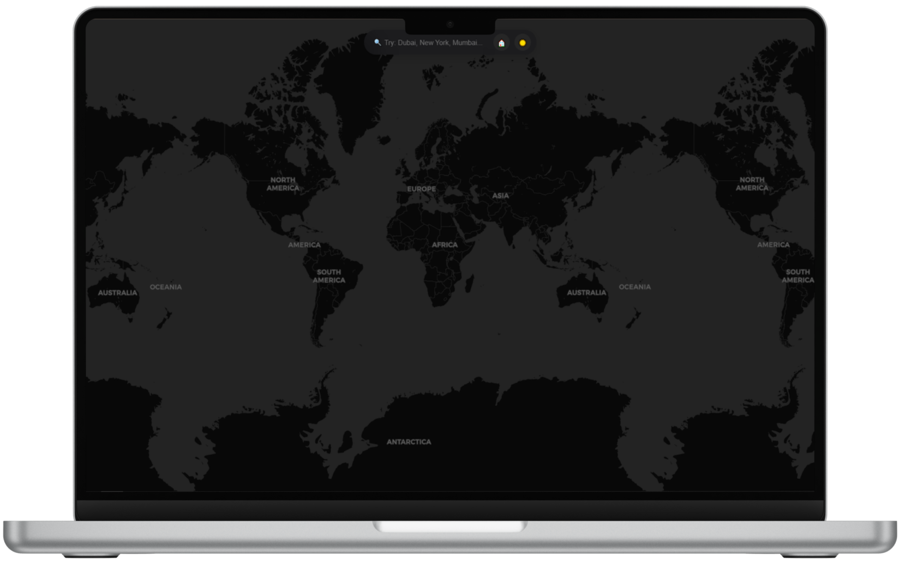

# 🗺️   Apple Inspired Global Weather Map

  

# 🚀 Features
* 🌍 Search any city or country across the globe
* 🧭 Animated fly transition to the searched location
* 🏠 Home button to reset back to global view
* ☀️ Light / 🌙 Dark mode toggle — smooth and elegant
* 💫 iOS-style UI with blurred top bar and minimal design
* 📍 Marker placement for searched cities
* 🖤 Subtle footer — “Inspired by  Maps”

# 🧩 Tech Stack
* HTML5 — Structure
* CSS3 — iOS-inspired styling and animations
* JavaScript (Vanilla) — Map control & interactivity
* Leaflet.js — Map rendering (OpenStreetMap tiles)

# 🧠 Inspiration
Designed to replicate the feel and polish of Apple Maps with smooth transitions, glassy UI, and a calm dark mode aesthetic.

# 🪄 Future Plans
* 🌤️ Integrate real-time weather info (temp, humidity, wind)
* ✨ Add city lights glow effect in dark mode
* 📅 Show local time and country flags
